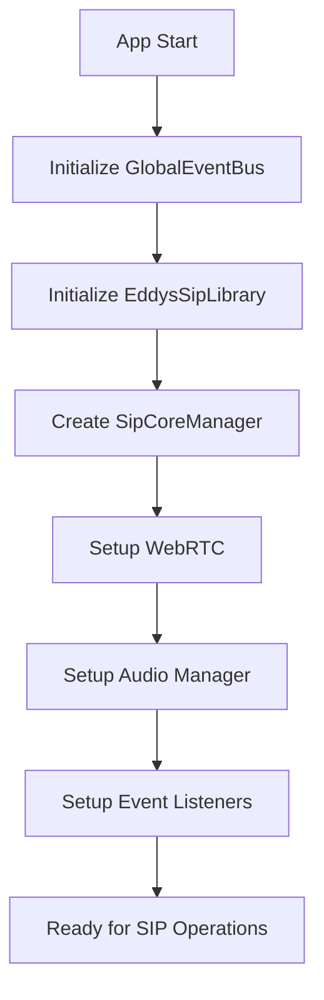
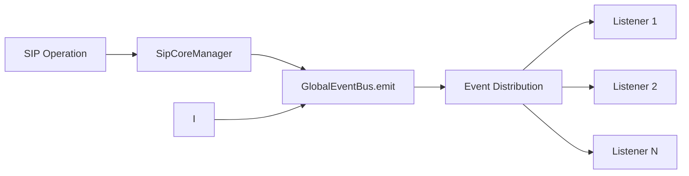

# 📁 Estructura de la Biblioteca EddysSipLibrary v3.0.0

## 🏗️ Arquitectura General

```
src/main/java/com/eddyslarez/siplibrary/
├── 📁 core/                          # Núcleo principal
│   ├── GlobalEventBus.kt             # Sistema de eventos independiente
│   └── SipCoreManager.kt             # Gestor principal SIP
│
├── 📁 events/                        # Sistema de eventos
│   └── SipEvent.kt                   # Eventos sealed class
│
├── 📁 interfaces/                    # Interfaces principales
│   ├── SipEventListener.kt           # Listener de eventos
│   ├── CallManager.kt                # Interface de gestión de llamadas
│   ├── AudioManager.kt               # Interface de gestión de audio
│   └── RingtoneManager.kt            # Interface de ringtones
│
├── 📁 error/                         # Sistema de errores
│   └── ErrorHandling.kt              # Manejo avanzado de errores
│
│├── 📁 extensions/                    # Extensiones y helpers
│   └── Extensions.kt                 # DSL y extensiones útiles
│
├── 📁 data/                          # Modelos de datos
│   ├── models/
│   │   ├── CallModels.kt             # Estados y datos de llamadas
│   │   ├── AccountInfo.kt            # Información de cuentas
│   │   ├── CallStatistics.kt         # Estadísticas de llamadas
│   │   └── AudioDevice.kt            # Dispositivos de audio
│   └── CallHistoryManager.kt         # Gestor de historial
│
├── 📁 services/                      # Servicios especializados
│   ├── audio/
│   │   ├── AndroidWebRtcManager.kt   # Implementación WebRTC Android
│   │   ├── EnhancedAudioDeviceManager.kt
│   │   ├── EnhancedRingtoneManager.kt
│   │   ├── CallHoldManager.kt
│   │   └── WebRtcManagerFactory.kt
│   │
│   ├── sip/
│   │   ├── SipMessageHandler.kt      # Manejo de mensajes SIP
│   │   ├── SipMessageBuilder.kt      # Constructor de mensajes
│   │   ├── SipMessageParser.kt       # Parser de mensajes
│   │   └── AuthenticationHandler.kt  # Autenticación SIP
│   │
│   └── websocket/
│       ├── MultiplatformWebSocket.kt # Interface WebSocket
│       └── WebSocket.kt              # Implementación WebSocket
│
├── 📁 utils/                         # Utilidades
│   ├── StateManager.kt               # Gestor de estado global
│   ├── NetworkQualityMonitor.kt      # Monitor de calidad de red
│   ├── CryptoUtils.kt                # Utilidades criptográficas
│   └── Utils.kt                      # Utilidades generales
│
├── 📁 platform/                      # Específico de plataforma
│   ├── PlatformInfo.kt               # Información de plataforma
│   ├── PlatformRegistration.kt       # Registro de eventos de plataforma
│   └── WindowManager.kt              # Gestión de ventanas
│
├── 📁 store/                         # Persistencia
│   └── SettingsDataStore.kt          # DataStore para configuraciones
│
└── EddysSipLibrary.kt                # Clase principal de la biblioteca
```

## 🔧 Componentes Principales

### 1. **Core (Núcleo)**
- **`GlobalEventBus`**: Sistema de eventos completamente independiente que permite agregar listeners desde cualquier parte de la aplicación
- **`SipCoreManager`**: Gestor principal que coordina todas las operaciones SIP

### 2. **Sistema de Eventos**
- **`SipEvent`**: Sealed class con todos los tipos de eventos
- **`SipEventListener`**: Interface con métodos por defecto para escuchar eventos

### 3. **Manejo de Errores**
- **`SipError`**: Errores categorizados con mensajes user-friendly
- **`TranslationError`**: Errores específicos de traducción
- **`ErrorExtensions`**: Helpers para manejo consistente de errores

### 4. **Extensiones y DSL**
- **`SipEventBusExtensions`**: Helpers para usar el EventBus fácilmente
- **`TranslationExtensions`**: Helpers para traducción independiente
- **`sipConfig { }`**: DSL para configuración fácil

## 🚀 Flujo de Inicialización



## 🔄 Flujo de Eventos



## 📱 Integración en Aplicaciones

### Estructura Recomendada en tu App

```
app/src/main/java/com/yourapp/
├── 📁 sip/
│   ├── SipService.kt                 # Servicio para SIP en background
│   ├── CallActivity.kt               # Activity para llamadas
│   └── SipEventHandler.kt            # Manejo centralizado de eventos
│
├── 📁 ui/
│   ├── call/
│       ├── CallScreen.kt             # Pantalla de llamada (Compose)
│       └── CallViewModel.kt          # ViewModel para llamadas
│  
│
└── MainActivity.kt
```

## 🎯 Puntos Clave de la Arquitectura

### ✅ **Modularidad**
- Cada componente es independiente y testeable
- La traducción funciona sin necesidad de SIP
- El sistema de eventos es completamente independiente

### ✅ **Facilidad de Uso**
- DSL para configuración simple
- Extensiones para operaciones comunes
- Manejo automático de errores con mensajes user-friendly

### ✅ **Flexibilidad**
- Listeners desde cualquier parte de la app
- Configuración granular de cada componente
- Soporte para múltiples cuentas SIP

### ✅ **Performance**
- Sistema de eventos thread-safe
- Gestión eficiente de memoria
- Flows reactivos para observación de estado

### ✅ **Mantenibilidad**
- Separación clara de responsabilidades
- Interfaces bien definidas
- Código organizado por funcionalidad

## 🔧 Configuración de Dependencias

### En tu `build.gradle.kts`:

```kotlin
dependencies {
    // Biblioteca principal
    implementation("com.eddyslarez:siplibrary:3.0.0")
    
    // Dependencias requeridas
    implementation("org.jetbrains.kotlinx:kotlinx-coroutines-android:1.7.3")
    implementation("androidx.lifecycle:lifecycle-runtime-ktx:2.7.0")
    
    // Para Compose (opcional)
    implementation("androidx.lifecycle:lifecycle-viewmodel-compose:2.7.0")
    
    // Para DataStore (si usas configuraciones persistentes)
    implementation("androidx.datastore:datastore-preferences:1.0.0")
}
```

## 📋 Checklist de Implementación

### ✅ **Configuración Inicial**
- [ ] Agregar permisos en AndroidManifest.xml
- [ ] Inicializar GlobalEventBus en Application
- [ ] Configurar SipLibrary con dominio y WebSocket URL

### ✅ **Eventos SIP**
- [ ] Crear SipEventListener personalizado
- [ ] Agregar listener usando SipEventBusExtensions
- [ ] Manejar eventos de llamadas entrantes/salientes
- [ ] Implementar manejo de errores

### ✅ **UI Integration**
- [ ] Crear ViewModels que observen estados reactivos
- [ ] Implementar pantallas de llamada
- [ ] Agregar controles de audio (mute, speaker, etc.)
- [ ] Implementar UI de traducción

### ✅ **Testing**
- [ ] Unit tests para lógica de negocio
- [ ] Integration tests para flujos completos
- [ ] UI tests para interacciones de usuario

Esta estructura modular y bien organizada hace que la biblioteca sea fácil de usar, mantener y extender, mientras proporciona todas las funcionalidades avanzadas que necesitas para una aplicación VoIP completa.